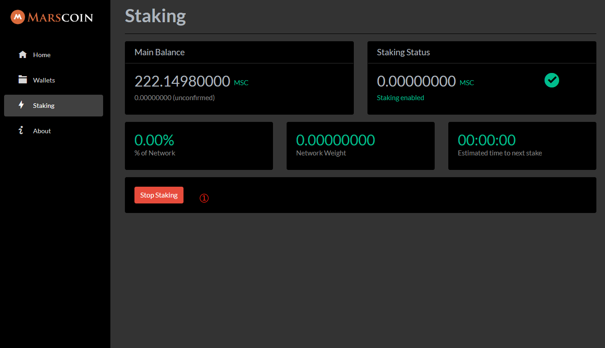

# How to stake

!!!
Staking and mining can be done simultaneously on one node. They do not influence each other and do not share interests.
!!!

Pos starts from block height 50,000.Everyone can participate in staking, but must run a node and use a wallet for staking and redemption operations. You can unstake at any time through your wallet.

## How it works

#### Hashing a valid kernel

How is a valid coinstake found? This is the heart of the processes.

The processes of staking will go as following, every time the masking of the timestamp is valid the node will iterate over all its stakeable outputs (the outputs that reached maturity and are beyond MaxReorg)

Then each output will be hashed with the following parameters:

Previous StakeModifier - the stake modifier is a chain of coinstake hashes
Output hash - the hash of the output of the coins that are being spent to find the kernel
Output N - the position of the output of the coins that are being spent to find the kernel
New coinstake current time - (the timestamp of the new output that will be created, this must fit the MASK rule)
The output hash of the above is called the Kernel.

The Target: The target is the number of which a kernel hash needs to be below in order to be considered valid. In order to give a better chance to bigger outputs (a UTXO with more coins) The target is pushed up by a factor to the number of coins a UTXO has, This is called the weighted target, it means the target of the UTXO is higher the more coins it has, as a result statistically it will find a solution faster.

If the resulting kernel hash of the above calculations is below the weighted target it means the coinstake is valid and can be used to create a block.

## Start Staking

Use a web browser to enter the wallet management interface and click the pledge link in the left menu.After entering the staking interface, select the wallet account, enter the password, and click to start staking.

After the pledge is successful, we can see as shown in the picture below that the pledge enters and waits for the block distribution. Specific allocation details can be found [here](https://github.com/block-core/blockcore/blob/master/Documentation/proof-of-stake.md)

